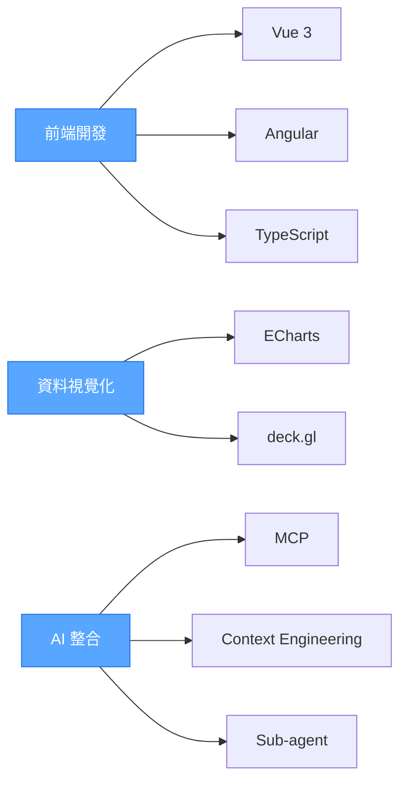

# 嗨，我是楊子毅 👋

一名專注於打造**簡潔、穩定、可維護**的前端工程師。擅長現代框架、資料視覺化與 AI 工具整合，透過最佳化的工程流程提升產品品質與開發效率。

---

## 🧩 技能與技術堆疊

### 前端框架
- **Vue 3** (Composition API / Script Setup) + Ant Design Vue
- **Angular** + Angular Material / Nebular

### 資料視覺化
- **Apache ECharts** - 互動式圖表與儀表板
- **deck.gl** - 大規模地理空間資料視覺化

### AI 工程與開發工具
- **MCP** (Model Context Protocol) 整合
- **Sub-agent** 協作流程設計
- **Context Engineering** 與提示工程
- **CLI 工具**與自動化腳本

### 其他技能
- REST API / GraphQL 整合
- UI/UX 元件系統設計
- Web 效能優化與除錯

---

## 🛠️ 技術工具

---

## 📊 GitHub 統計資料

  

---

## 🎯 技術架構

---

## 📫 聯絡方式

---

  

