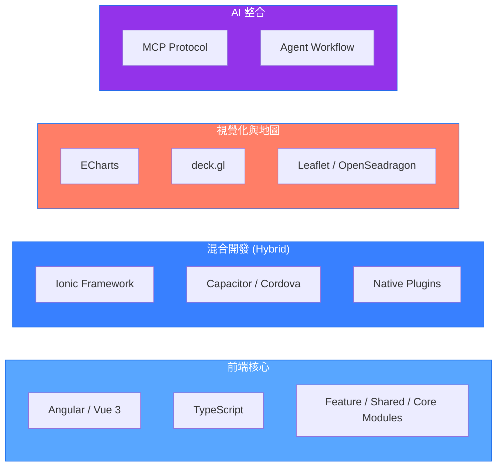

# 楊子毅 | Frontend Engineer

專注於現代前端框架、資料視覺化、混合行動開發與 AI 工具整合。

---

## 💻 技術堆疊

### 🎯 前端核心與框架

- **Angular** (Component / Module 架構)
- **Vue 3** (Composition API)
- **TypeScript**

### 📱 跨平台與混合開發 (Hybrid Mobile)

- **Ionic Framework** (UI & UX)
- **Capacitor / Cordova** (Native Bridge & Runtime)

### 📊 資料視覺化與地圖應用

- **Apache ECharts** (互動圖表)
- **deck.gl** (大規模數據可視化)
- **Leaflet** (輕量級地圖)
- **OpenSeadragon** (高解析度圖像縮放)

### 🏗️ 架構設計

- **元件拆分與組織**：專注於可重用元件設計與模組結構規劃
- **模組設計模式**：Feature / Shared / Core Module 的架構實踐
- **跨專案共享**：建立 npm package 實現模組化共用

### 🤖 AI 工程與協作

- **Context Engineering**
- **MCP** (Model Context Protocol)
- **Sub-agent 協作流程**

---

## 技術架構視圖

---

## GitHub

