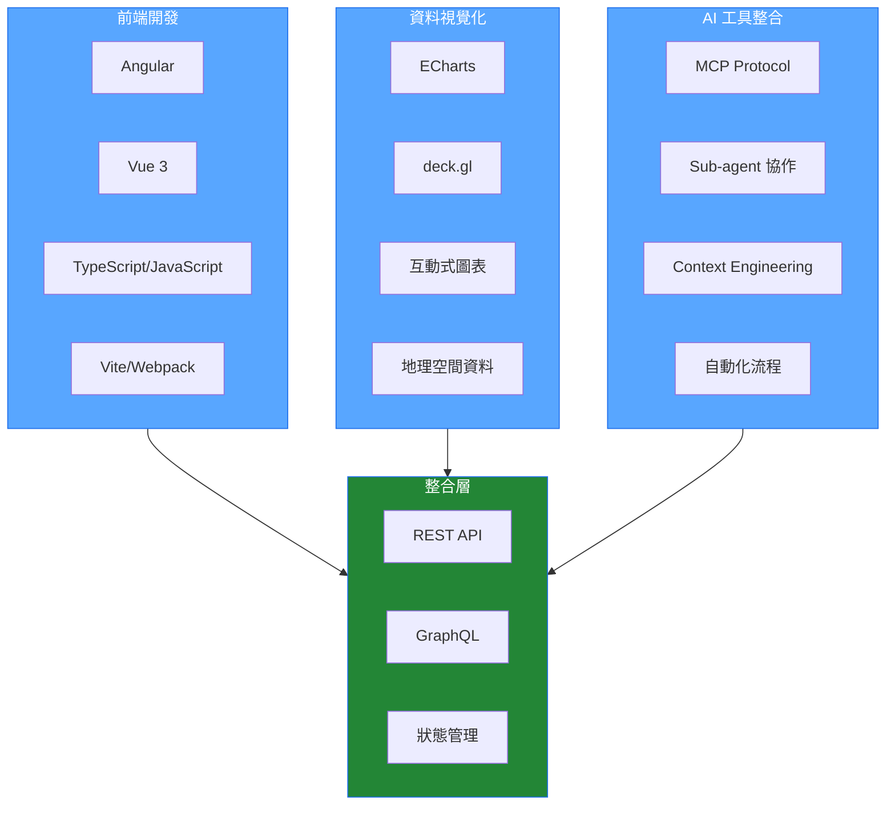

# 楊子毅 | Frontend Engineer

專注於現代前端框架、資料視覺化與 AI 工具整合。

---

## 💻 技術堆疊

### 🎯 前端框架

**Angular** (Component / Module 架構) • **Vue 3** (Composition API / Script Setup)

### 🏗️ 架構與模組化

可重用元件設計 • Feature / Shared / Core Module • npm package 開發

### 📊 資料視覺化

**Apache ECharts** • **deck.gl**

### 🤖 AI 工程工具

**MCP** (Model Context Protocol) • **Sub-agent 協作流程** • **Context Engineering**

### 🛠️ 開發工具

TypeScript / JavaScript • Vite / Webpack • REST API / GraphQL • Git / GitHub

---

## 技術架構

---

## GitHub

