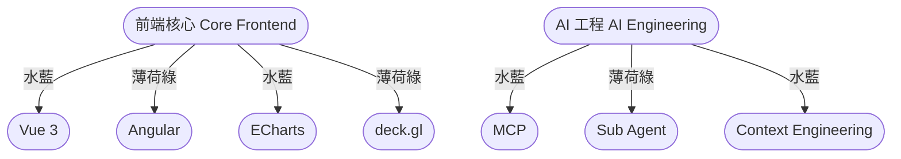

# 嗨，我是楊子毅 👋

一名專注於打造 **簡潔、穩定、可維護** 的前端工程師。擅長現代框架、資料視覺化與 AI 工具整合，透過最佳化的工程流程提升產品品質與開發效率。

---

## 🎨 主題色彩（雙色，水藍色 ± 60° 配色）

* **Primary 主色（水藍色）**：`#00A8E8`
* **Secondary 副色（薄荷綠）**：`#00E8A8`

---

## 🧩 技能與技術堆疊

### **前端框架**

*  **Vue 3**（Composition API / Script Setup） + **Ant Design Vue**
*  **Angular** + **Angular Material / Nebular Theme**

### **資料視覺化（Data Visualization）**

*  **ECharts**
*  **deck.gl**

### **AI 工程（AI Engineering）**

* MCP（Model Context Protocol）
* Sub-agent 協作流程
* Context engineering
* CLI 工具與自動化

### **其他技能**

* REST / GraphQL API
* UI/UX 元件設計
* Web 性能優化

---

## 🛠️ 工具圖標

---

## 📊 GitHub 統計資料

---

## 🎨 極簡雙色視覺示意圖（Mermaid 配合水藍＋薄荷綠）

---

## 🐍 動態貢獻蛇形圖

---

## 🖼️ 極簡 SVG Banner（自動深色 / 淺色）

<svg width="100%" height="120" viewBox="0 0 800 120" xmlns="http://www.w3.org/2000/svg">
  
  <text x="50%" y="50%" dominant-baseline="middle" text-anchor="middle">
    Yang Tzu Yi — Front-End Engineer
  </text>
</svg>

---

## ⌨️ 動態標題 Banner

---
