# 楊子毅 | Frontend Engineer

專注於現代前端框架、資料視覺化與 AI 工具整合。

---

## 💻 技術堆疊

### 🎯 前端框架
- **Angular** (Component / Module 架構)
  - Angular Material / Nebular
- **Vue 3** (Composition API / Script Setup)
  - Ant Design Vue

### 🏗️ 架構與模組化
- 可重用元件設計與規劃
- Feature / Shared / Core Module 設計模式
- npm package 開發與跨專案共享

### 📊 資料視覺化
- **Apache ECharts**
- **deck.gl**

### 🤖 AI 工程工具
- **MCP** (Model Context Protocol)
- **Sub-agent 協作流程**
- **Context Engineering**

### 🛠️ 開發工具
- TypeScript / JavaScript
- Vite / Webpack
- REST API / GraphQL
- Git / GitHub

---

## 🔧 技術工具

---

## 技術架構

```mermaid
graph TB
    subgraph Frontend["前端開發"]
        A1[Angular]
        A2[Vue 3]
        A3[TypeScript/JavaScript]
        A4[Vite/Webpack]
    end
    
    subgraph Visualization["資料視覺化"]
        B1[ECharts]
        B2[deck.gl]
        B3[互動式圖表]
        B4[地理空間資料]
    end
    
    subgraph AI["AI 工具整合"]
        C1[MCP Protocol]
        C2[Sub-agent 協作]
        C3[Context Engineering]
        C4[自動化流程]
    end
    
    subgraph Integration["整合層"]
        D1[REST API]
        D2[GraphQL]
        D3[狀態管理]
    end
    
    Frontend --> Integration
    Visualization --> Integration
    AI --> Integration
    
    style Frontend fill:#58A6FF,stroke:#1F6FEB,color:#fff
    style Visualization fill:#58A6FF,stroke:#1F6FEB,color:#fff
    style AI fill:#58A6FF,stroke:#1F6FEB,color:#fff
    style Integration fill:#238636,stroke:#1F6FEB,color:#fff
```

---

## GitHub

