# 楊子毅 | Frontend Engineer

專注於現代前端框架、資料視覺化、混合行動開發與 AI 工具整合。

---

## 💻 技術堆疊

### 🎯 前端核心與框架

**Angular** (Component / Module 架構) • **Vue 3** (Composition API) • **TypeScript**

### 📱 跨平台與混合開發 (Hybrid Mobile)

**Ionic Framework** (UI & UX) • **Capacitor / Cordova** (Native Bridge & Runtime)

### 📊 資料視覺化與地圖應用

**Apache ECharts** (互動圖表) • **deck.gl** (大規模數據可視化)
**Leaflet** (輕量級地圖) • **OpenSeadragon** (高解析度圖像縮放)

### 🏗️ 架構設計與工具

可重用元件設計 • Monorepo 管理 • npm package 開發

### 🤖 AI 工程與協作

**MCP** (Model Context Protocol) • **Sub-agent 協作流程** • **Context Engineering**

---

## 技術架構視圖

```mermaid
graph TB
    subgraph Frontend["前端核心"]
        A1[Angular / Vue 3]
        A2[TypeScript]
        A3[Component Design]
    end

    subgraph Mobile["混合開發 (Hybrid)"]
        M1[Ionic Framework]
        M2[Capacitor / Cordova]
        M3[Native Plugins]
    end
    
    subgraph Visualization["視覺化與地圖"]
        B1[ECharts]
        B2[deck.gl]
        B3[Leaflet / OpenSeadragon]
    end
    
    subgraph AI["AI 整合"]
        C1[MCP Protocol]
        C2[Agent Workflow]
    end
    
    Frontend --> Mobile
    Frontend --> Visualization
    Mobile --> Visualization
    AI -.-> Frontend
    AI -.-> Mobile
    
    style Frontend fill:#58A6FF,stroke:#1F6FEB,color:#fff
    style Mobile fill:#3880FF,stroke:#1F6FEB,color:#fff
    style Visualization fill:#FF7E67,stroke:#1F6FEB,color:#fff
    style AI fill:#9333EA,stroke:#1F6FEB,color:#fff
```

---

## GitHub

